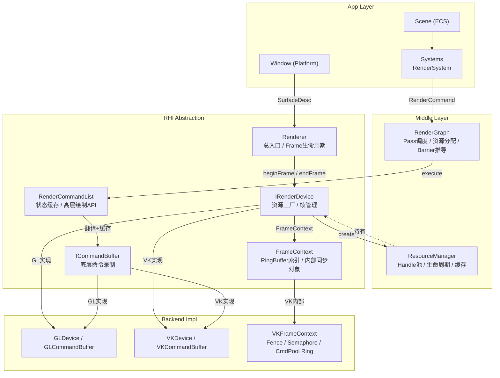
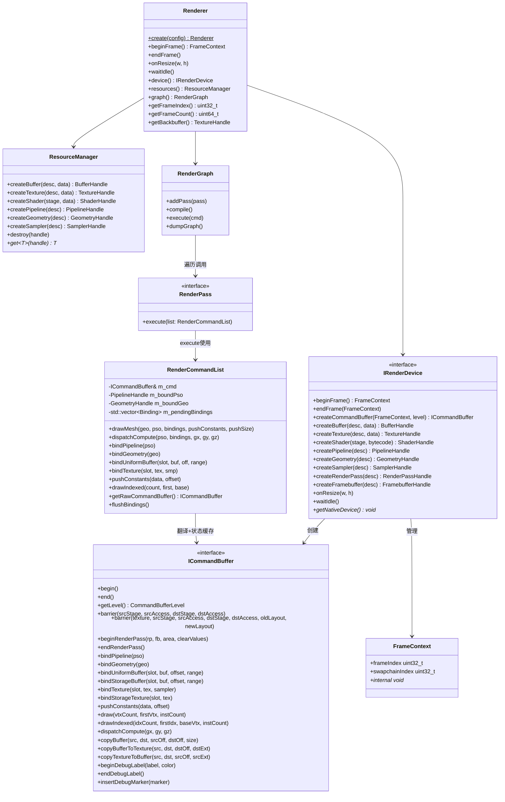
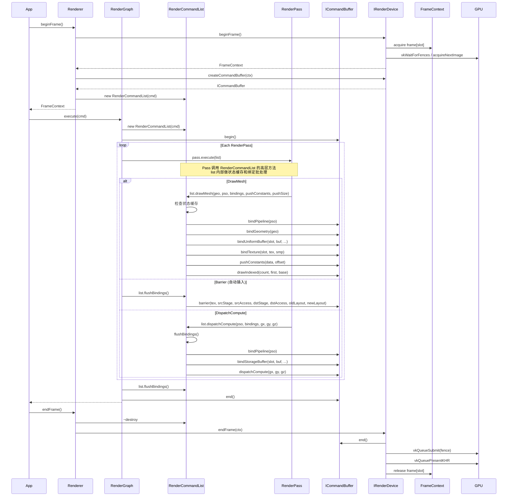
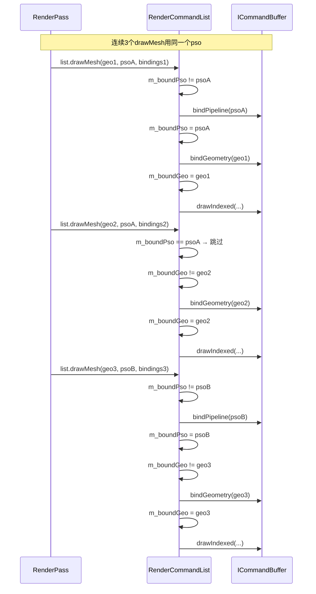

# RHI (Rendering Hardware Interface) 设计文档 v1.1

> **目标**：以 Vulkan 显式模型为基准，OpenGL 通过适配层模拟。  
> **支撑**：RenderGraph、Compute Shader Lab、多后端（GL/VK）、及未来扩展（多线程、Async Compute、Multiview、Ray Tracing）。  
> **原则**：抽象层只表达"GPU 实际在做什么"，不表达"某个 API 让你怎么调用"。

---

## 目录

1. [架构总览](#1-架构总览)
2. [数据流与时序](#2-数据流与时序)
3. [Core 层](#3-core-层)
4. [RHI 抽象接口](#4-rhi-抽象接口)
5. [后端实现约束](#5-后端实现约束)
6. [扩展预留](#6-扩展预留)
7. [AI 实现铁律](#7-ai-实现铁律)

---

## 1. 架构总览

### 1.1 分层架构图



### 1.2 核心类图



---

## 2. 数据流与时序

### 2.1 单帧渲染时序



### 2.2 RenderCommandList 状态缓存机制



---

## 3. Core 层

### 3.1 Handle.hpp

```cpp
#pragma once
#include <cstdint>
#include <functional>

namespace rhi {

template <typename Tag>
class Handle {
public:
    Handle() = default;
    explicit Handle(uint32_t id) : m_id(id) {}

    uint32_t id() const { return m_id; }
    bool valid() const { return m_id != 0; }

    bool operator==(Handle other) const { return m_id == other.m_id; }
    bool operator!=(Handle other) const { return m_id != other.m_id; }
    bool operator<(Handle other) const { return m_id < other.m_id; }

    struct Hash {
        size_t operator()(Handle h) const { return std::hash<uint32_t>{}(h.m_id); }
    };

private:
    uint32_t m_id = 0;
};

struct BufferTag {};
struct TextureTag {};
struct ShaderTag {};
struct PipelineTag {};
struct GeometryTag {};
struct SamplerTag {};
struct RenderPassTag {};
struct FramebufferTag {};
struct AccelerationStructureTag {};  // [RESERVE: RayTracing]

using BufferHandle     = Handle<BufferTag>;
using TextureHandle    = Handle<TextureTag>;
using ShaderHandle     = Handle<ShaderTag>;
using PipelineHandle   = Handle<PipelineTag>;
using GeometryHandle   = Handle<GeometryTag>;
using SamplerHandle    = Handle<SamplerTag>;
using RenderPassHandle = Handle<RenderPassTag>;
using FramebufferHandle= Handle<FramebufferTag>;
using AccelerationStructureHandle = Handle<AccelerationStructureTag>;  // [RESERVE]

} // namespace rhi
```

### 3.2 Format.hpp

```cpp
#pragma once
#include <cstdint>

namespace rhi {

enum class Format {
    Unknown,
    R8_UNORM, RG8_UNORM, RGBA8_UNORM, BGRA8_UNORM,
    RGBA8_SRGB, BGRA8_SRGB,
    R16_FLOAT, RG16_FLOAT, RGBA16_FLOAT, R16_UNORM,
    R32_FLOAT, RG32_FLOAT, RGB32_FLOAT, RGBA32_FLOAT,
    R32_UINT, R32_SINT, RG32_UINT, RGBA32_UINT,
    D16_UNORM, D32_FLOAT, D24_UNORM_S8_UINT, D32_FLOAT_S8_UINT,
    BC1_RGB_UNORM, BC3_RGBA_UNORM, BC5_RG_UNORM, BC7_RGBA_UNORM,
};

inline uint32_t formatByteSize(Format f) { /* ... */ return 0; }
inline uint32_t formatComponentCount(Format f) { /* ... */ return 0; }
inline bool isDepthFormat(Format f) { /* ... */ return false; }
inline bool isStencilFormat(Format f) { /* ... */ return false; }

} // namespace rhi
```

### 3.3 Types.hpp

```cpp
#pragma once
#include <cstdint>
#include <array>

namespace rhi {

struct Extent2D { uint32_t width = 0, height = 0; };
struct Extent3D { uint32_t width = 0, height = 0, depth = 1; };
struct Offset2D { int32_t x = 0, y = 0; };
struct Offset3D { int32_t x = 0, y = 0, z = 0; };
struct Rect2D { Offset2D offset; Extent2D extent; };
struct Viewport { float x, y, width, height, minDepth, maxDepth; };
struct ClearColor { std::array<float, 4> rgba = {0,0,0,1}; };
struct ClearDepthStencil { float depth = 1.0f; uint32_t stencil = 0; };
union ClearValue { ClearColor color; ClearDepthStencil depthStencil; };

enum class ShaderStage : uint32_t {
    Vertex   = 1 << 0,
    Fragment = 1 << 1,
    Compute  = 1 << 2,
    RayGen   = 1 << 3,      // [RESERVE: RayTracing]
    Miss     = 1 << 4,      // [RESERVE: RayTracing]
    ClosestHit = 1 << 5,    // [RESERVE: RayTracing]
    Mesh     = 1 << 6,      // [RESERVE: MeshShader]
    Task     = 1 << 7,      // [RESERVE: MeshShader]
};

inline ShaderStage operator|(ShaderStage a, ShaderStage b) {
    return static_cast<ShaderStage>(static_cast<uint32_t>(a) | static_cast<uint32_t>(b));
}

enum class IndexType { UInt16, UInt32 };

enum class BufferUsage : uint32_t {
    None = 0,
    Vertex = 1 << 0, Index = 1 << 1, Uniform = 1 << 2,
    Storage = 1 << 3, TransferSrc = 1 << 4, TransferDst = 1 << 5,
    AccelerationStructureInput = 1 << 6,  // [RESERVE: RayTracing]
    AccelerationStructureBuild = 1 << 7,  // [RESERVE: RayTracing]
};

inline BufferUsage operator|(BufferUsage a, BufferUsage b) {
    return static_cast<BufferUsage>(static_cast<uint32_t>(a) | static_cast<uint32_t>(b));
}
inline bool hasUsage(BufferUsage flags, BufferUsage flag) {
    return (static_cast<uint32_t>(flags) & static_cast<uint32_t>(flag)) != 0;
}

enum class TextureUsage : uint32_t {
    None = 0,
    Sampled = 1 << 0, ColorAttachment = 1 << 1,
    DepthStencilAttachment = 1 << 2, Storage = 1 << 3,
    TransferSrc = 1 << 4, TransferDst = 1 << 5,
};

inline TextureUsage operator|(TextureUsage a, TextureUsage b) {
    return static_cast<TextureUsage>(static_cast<uint32_t>(a) | static_cast<uint32_t>(b));
}

enum class MemoryProperty : uint32_t {
    DeviceLocal = 1 << 0,
    HostVisible = 1 << 1,
    HostCoherent = 1 << 2,
    HostCached = 1 << 3,
};

} // namespace rhi
```

---

## 4. RHI 抽象接口

### 4.1 FrameContext.hpp

```cpp
#pragma once
#include <cstdint>

namespace rhi {

// 每帧由 IRenderDevice::beginFrame() 产出，endFrame() 消费
// 上层只读 frameIndex / swapchainIndex
// 所有同步细节（Fence / Semaphore / CommandPool）由后端内部管理
struct FrameContext {
    uint32_t frameIndex = 0;      // Ring Buffer 索引
    uint32_t swapchainIndex = 0;  // Swapchain Image 索引
    void* internal = nullptr;     // 类型擦除，仅供后端使用
};

} // namespace rhi
```

### 4.2 IRenderDevice.hpp

```cpp
#pragma once
#include "Core/Handle.hpp"
#include "Core/Types.hpp"
#include "FrameContext.hpp"
#include <memory>
#include <span>

namespace rhi {

class ICommandBuffer;
class ISurface;

struct DeviceConfig {
    SurfaceDesc surface;
    bool enableValidation = true;
    bool enableDebugMarkers = true;
    uint32_t framesInFlight = 2;
};

// [RESERVE: 多线程录制] CommandBuffer 级别
enum class CommandBufferLevel {
    Primary,    // 可提交到 Queue，可调用 Secondary
    Secondary,  // 只能被 Primary execute，可在后台线程录制
};

// [RESERVE: AsyncCompute] Queue 类型
enum class QueueType {
    Graphics,   // 默认，支持绘制、计算、复制
    Compute,    // 专用计算队列
    Transfer,   // 专用传输队列
};

class IRenderDevice {
public:
    virtual ~IRenderDevice() = default;

    // === 帧生命周期 ===
    virtual FrameContext beginFrame() = 0;
    virtual void endFrame(FrameContext ctx) = 0;

    // === 命令缓冲 ===
    virtual std::unique_ptr<ICommandBuffer> createCommandBuffer(
        FrameContext ctx,
        CommandBufferLevel level = CommandBufferLevel::Primary) = 0;

    // [RESERVE: 多线程] 批量分配 Secondary CommandBuffer
    // virtual std::vector<std::unique_ptr<ICommandBuffer>> allocateSecondaryCommandBuffers(
    //     FrameContext ctx, uint32_t count) = 0;

    // === 资源创建 ===
    virtual BufferHandle   createBuffer(const BufferDesc& desc, const void* initialData = nullptr) = 0;
    virtual TextureHandle  createTexture(const TextureDesc& desc, const void* initialData = nullptr) = 0;
    virtual ShaderHandle   createShader(ShaderStage stage, std::span<const uint8_t> bytecode) = 0;
    virtual PipelineHandle createPipeline(const PipelineDesc& desc) = 0;
    virtual GeometryHandle createGeometry(const GeometryDesc& desc) = 0;
    virtual SamplerHandle  createSampler(const SamplerDesc& desc) = 0;
    virtual RenderPassHandle   createRenderPass(const RenderPassDesc& desc) = 0;
    virtual FramebufferHandle  createFramebuffer(const FramebufferDesc& desc) = 0;

    // [RESERVE: RayTracing]
    // virtual AccelerationStructureHandle createAccelerationStructure(const BLASDesc& desc) = 0;
    // virtual AccelerationStructureHandle createAccelerationStructure(const TLASDesc& desc) = 0;
    // virtual void buildAccelerationStructure(AccelerationStructureHandle as, ...) = 0;

    // === 窗口响应 ===
    virtual void onResize(uint32_t width, uint32_t height) = 0;
    virtual void waitIdle() = 0;
    virtual void* getNativeDevice() = 0;

    // [RESERVE: AsyncCompute] 获取专用队列的 CommandBuffer
    // virtual std::unique_ptr<ICommandBuffer> createComputeCommandBuffer(
    //     QueueType queue = QueueType::Compute) = 0;
    // virtual void submitToQueue(QueueType queue, ICommandBuffer* cmd, FenceHandle fence) = 0;
};

} // namespace rhi
```

### 4.3 ICommandBuffer.hpp

```cpp
#pragma once
#include "Core/Handle.hpp"
#include "Core/Types.hpp"
#include "Core/Format.hpp"
#include <span>

namespace rhi {

enum class PipelineStage : uint32_t {
    TopOfPipe = 1 << 0,
    DrawIndirect = 1 << 1,
    VertexInput = 1 << 2,
    VertexShader = 1 << 3,
    FragmentShader = 1 << 4,
    EarlyFragmentTests = 1 << 5,
    LateFragmentTests = 1 << 6,
    ColorAttachmentOutput = 1 << 7,
    ComputeShader = 1 << 8,
    Transfer = 1 << 9,
    BottomOfPipe = 1 << 10,
    Host = 1 << 11,
    RayTracingShader = 1 << 12,  // [RESERVE: RayTracing]
};

enum class AccessFlags : uint32_t {
    None = 0,
    IndirectCommandRead = 1 << 0,
    IndexRead = 1 << 1,
    VertexAttributeRead = 1 << 2,
    UniformRead = 1 << 3,
    ShaderRead = 1 << 4,
    ShaderWrite = 1 << 5,
    ColorAttachmentRead = 1 << 6,
    ColorAttachmentWrite = 1 << 7,
    DepthStencilAttachmentRead = 1 << 8,
    DepthStencilAttachmentWrite = 1 << 9,
    TransferRead = 1 << 10,
    TransferWrite = 1 << 11,
    MemoryRead = 1 << 12,
    MemoryWrite = 1 << 13,
    AccelerationStructureRead = 1 << 14,  // [RESERVE: RayTracing]
    AccelerationStructureWrite = 1 << 15, // [RESERVE: RayTracing]
};

enum class ImageLayout {
    Undefined,
    General,
    ColorAttachment,
    DepthStencilAttachment,
    DepthStencilReadOnly,
    ShaderRead,
    TransferSrc,
    TransferDst,
    PresentSrc,
    AccelerationStructure,  // [RESERVE: RayTracing]
};

// 底层命令录制接口
// 职责：直接翻译为 vkCmd* / gl*，不做状态缓存，不做高层抽象
// 使用者：RenderCommandList（通过状态缓存优化后调用）
class ICommandBuffer {
public:
    virtual ~ICommandBuffer() = default;

    virtual void begin() = 0;
    virtual void end() = 0;

    // [RESERVE: 多线程] Secondary CommandBuffer 不能 begin/endRenderPass
    virtual CommandBufferLevel getLevel() const = 0;

    // [RESERVE: 多线程] Primary 执行 Secondary
    // virtual void executeSecondary(std::span<ICommandBuffer*> secondaryCmds) = 0;

    // === Barrier ===
    virtual void barrier(PipelineStage srcStage, AccessFlags srcAccess,
                         PipelineStage dstStage, AccessFlags dstAccess) = 0;
    virtual void barrier(TextureHandle texture,
                         PipelineStage srcStage, AccessFlags srcAccess,
                         PipelineStage dstStage, AccessFlags dstAccess,
                         ImageLayout oldLayout, ImageLayout newLayout) = 0;
    // [RESERVE: RayTracing] Buffer barrier for AS build
    // virtual void barrier(AccelerationStructureHandle as, ...) = 0;

    // === RenderPass ===
    virtual void beginRenderPass(RenderPassHandle rp, FramebufferHandle fb,
                                  const Rect2D& renderArea,
                                  std::span<const ClearValue> clearValues) = 0;
    virtual void endRenderPass() = 0;

    // [RESERVE: Multiview] 一次 beginRenderPass 绘制到多个 view
    // virtual void beginRenderPass(RenderPassHandle rp, FramebufferHandle fb,
    //                               const Rect2D& renderArea,
    //                               std::span<const ClearValue> clearValues,
    //                               uint32_t viewMask) = 0;

    // === 绑定 ===
    virtual void bindPipeline(PipelineHandle pipeline) = 0;
    virtual void bindGeometry(GeometryHandle geometry) = 0;
    virtual void bindUniformBuffer(uint32_t slot, BufferHandle buffer, uint64_t offset, uint64_t range) = 0;
    virtual void bindStorageBuffer(uint32_t slot, BufferHandle buffer, uint64_t offset, uint64_t range) = 0;
    virtual void bindTexture(uint32_t slot, TextureHandle texture, SamplerHandle sampler) = 0;
    virtual void bindStorageTexture(uint32_t slot, TextureHandle texture) = 0;
    virtual void pushConstants(std::span<const uint8_t> data, uint32_t offset = 0) = 0;

    // === 绘制 ===
    virtual void draw(uint32_t vertexCount, uint32_t firstVertex, uint32_t instanceCount = 1) = 0;
    virtual void drawIndexed(uint32_t indexCount, uint32_t firstIndex,
                              int32_t vertexOffset = 0, uint32_t instanceCount = 1) = 0;

    // [RESERVE: MeshShader] 取代 drawIndexed
    // virtual void drawMeshTasks(uint32_t taskX, uint32_t taskY, uint32_t taskZ = 1) = 0;

    // === 计算 ===
    virtual void dispatchCompute(uint32_t groupX, uint32_t groupY, uint32_t groupZ = 1) = 0;

    // [RESERVE: RayTracing]
    // virtual void traceRays(uint32_t width, uint32_t height, uint32_t depth = 1) = 0;
    // virtual void buildAccelerationStructure(AccelerationStructureHandle as, ...) = 0;

    // === 复制 ===
    virtual void copyBuffer(BufferHandle src, BufferHandle dst,
                             uint64_t srcOffset, uint64_t dstOffset, uint64_t size) = 0;
    virtual void copyBufferToTexture(BufferHandle src, TextureHandle dst,
                                        const Offset3D& dstOffset, const Extent3D& dstExtent) = 0;
    virtual void copyTextureToBuffer(TextureHandle src, BufferHandle dst,
                                        const Offset3D& srcOffset, const Extent3D& srcExtent) = 0;

    // === 调试 ===
    virtual void beginDebugLabel(const char* label, std::array<float, 4> color = {1,1,1,1}) = 0;
    virtual void endDebugLabel() = 0;
    virtual void insertDebugMarker(const char* marker) = 0;
};

} // namespace rhi
```

### 4.4 RenderCommandList.hpp（新增）

```cpp
#pragma once
#include "Core/Handle.hpp"
#include "Core/Types.hpp"
#include "ICommandBuffer.hpp"
#include <vector>
#include <span>

namespace rhi {

// 绑定描述（RenderCommandList 的 drawMesh / dispatchCompute 使用）
struct Binding {
    enum class Type { UniformBuffer, StorageBuffer, Texture, StorageTexture } type;
    uint32_t slot = 0;
    union {
        BufferHandle buffer;
        TextureHandle texture;
    };
    uint64_t offset = 0;
    uint64_t range = 0;      // buffer 用
    SamplerHandle sampler;   // texture 用（Type::Texture 时有效）
};

// 每 Pass 的命令列表录制器
// 职责：
//   1. 提供高层绘制方法（drawMesh, dispatchCompute），接口友好
//   2. 管理当前绑定状态缓存，避免冗余 API 调用
//   3. 攒批绑定（uniform + texture + push constant），减少 descriptor set 切换
//   4. 最终翻译为 ICommandBuffer 的底层命令
//
// 生命周期：RenderGraph::execute() 创建 → 遍历完所有 Pass 后销毁
// 注意：不是每帧全局对象，是每次 execute 的局部对象
class RenderCommandList {
public:
    explicit RenderCommandList(ICommandBuffer& cmd);
    ~RenderCommandList();

    // === 高层绘制方法（RenderPass::execute 里调用）===
    // 自动处理：状态缓存检查、绑定批处理、push constant 刷新
    void drawMesh(GeometryHandle geo, PipelineHandle pso,
                  const std::vector<Binding>& bindings,
                  const void* pushConstants = nullptr, uint32_t pushSize = 0);

    void dispatchCompute(PipelineHandle pso,
                         const std::vector<Binding>& bindings,
                         uint32_t groupX, uint32_t groupY, uint32_t groupZ = 1);

    // === 底层方法（需要精细控制时使用）===
    void bindPipeline(PipelineHandle pso);
    void bindGeometry(GeometryHandle geo);
    void bindUniformBuffer(uint32_t slot, BufferHandle buffer, uint64_t offset, uint64_t range);
    void bindTexture(uint32_t slot, TextureHandle texture, SamplerHandle sampler);
    void pushConstants(std::span<const uint8_t> data, uint32_t offset = 0);
    void drawIndexed(uint32_t indexCount, uint32_t firstIndex = 0, int32_t vertexOffset = 0);

    // === 紧急出口：直接操作底层 CommandBuffer ===
    ICommandBuffer& getRawCommandBuffer();

    // === 手动刷新缓存（RenderGraph 插入 Barrier 前调用）===
    void flushBindings();

private:
    ICommandBuffer& m_cmd;

    // 绑定状态缓存
    PipelineHandle m_boundPso;
    GeometryHandle m_boundGeo;
    bool m_psoDirty = false;
    bool m_geoDirty = false;

    // 待提交的绑定（攒批）
    std::vector<Binding> m_pendingBindings;
    bool m_bindingsDirty = false;

    // 待提交的 push constants
    std::vector<uint8_t> m_pendingPushConstants;
    uint32_t m_pushOffset = 0;
    bool m_pushDirty = false;

    void applyBindings();
    void applyPushConstants();
};

} // namespace rhi
```

### 4.5 IBuffer.hpp

```cpp
#pragma once
#include "Core/Types.hpp"
#include "Core/Handle.hpp"

namespace rhi {

struct BufferDesc {
    uint64_t size = 0;
    BufferUsage usage = BufferUsage::None;
    MemoryProperty memory = MemoryProperty::DeviceLocal;
    bool cpuAccessible = false;
};

class IBuffer {
public:
    virtual ~IBuffer() = default;
    virtual uint64_t getSize() const = 0;
    virtual void* map(uint64_t offset, uint64_t size) = 0;
    virtual void unmap() = 0;
    virtual void flush(uint64_t offset, uint64_t size) = 0;
};

} // namespace rhi
```

### 4.6 ITexture.hpp

```cpp
#pragma once
#include "Core/Types.hpp"
#include "Core/Format.hpp"
#include "Core/Handle.hpp"

namespace rhi {

enum class TextureType {
    Texture1D, Texture2D, Texture3D, TextureCube, Texture2DArray,
};

struct TextureDesc {
    TextureType type = TextureType::Texture2D;
    Format format = Format::Unknown;
    Extent3D extent;
    uint32_t mipLevels = 1;
    uint32_t arrayLayers = 1;
    TextureUsage usage = TextureUsage::Sampled;
    MemoryProperty memory = MemoryProperty::DeviceLocal;
    bool cpuAccessible = false;
};

struct TextureViewDesc {
    TextureHandle source;
    Format format;
    uint32_t baseMipLevel = 0;
    uint32_t mipLevelCount = 1;
    uint32_t baseArrayLayer = 0;
    uint32_t arrayLayerCount = 1;
};

} // namespace rhi
```

### 4.7 IShader.hpp

```cpp
#pragma once
#include "Core/Types.hpp"
#include <span>
#include <cstdint>

namespace rhi {

struct ShaderBytecode {
    std::span<const uint8_t> data;
    const char* entryPoint = "main";
};

class IShader {
public:
    virtual ~IShader() = default;
    virtual ShaderStage getStage() const = 0;
};

} // namespace rhi
```

### 4.8 IPipeline.hpp

```cpp
#pragma once
#include "Core/Handle.hpp"
#include "Core/Format.hpp"
#include "Core/Types.hpp"
#include <vector>

namespace rhi {

struct VertexAttribute {
    uint32_t location = 0;
    Format format = Format::Unknown;
    uint32_t offset = 0;
    uint32_t bufferSlot = 0;
    uint32_t stride = 0;
};

struct RasterState {
    enum class CullMode { None, Front, Back };
    enum class FrontFace { CounterClockwise, Clockwise };
    enum class PolygonMode { Fill, Line, Point };
    CullMode cullMode = CullMode::Back;
    FrontFace frontFace = FrontFace::CounterClockwise;
    PolygonMode polygonMode = PolygonMode::Fill;
    bool depthClampEnable = false;
    bool scissorEnable = false;
};

struct DepthStencilState {
    bool depthTestEnable = true;
    bool depthWriteEnable = true;
    enum class CompareOp { Never, Less, Equal, LessEqual, Greater, NotEqual, GreaterEqual, Always };
    CompareOp depthCompareOp = CompareOp::Less;
    bool stencilTestEnable = false;
};

struct BlendState {
    bool enable = false;
    enum class BlendFactor { Zero, One, SrcColor, OneMinusSrcColor, SrcAlpha, OneMinusSrcAlpha, DstAlpha, DstColor };
    enum class BlendOp { Add, Subtract, ReverseSubtract, Min, Max };
    BlendFactor srcColorFactor = BlendFactor::One;
    BlendFactor dstColorFactor = BlendFactor::Zero;
    BlendOp colorOp = BlendOp::Add;
    BlendFactor srcAlphaFactor = BlendFactor::One;
    BlendFactor dstAlphaFactor = BlendFactor::Zero;
    BlendOp alphaOp = BlendOp::Add;
    bool writeR = true, writeG = true, writeB = true, writeA = true;
};

struct PipelineDesc {
    ShaderHandle vertexShader;
    ShaderHandle fragmentShader;
    ShaderHandle computeShader;  // 若设置，则为计算管线，忽略 VS/FS

    std::vector<VertexAttribute> vertexLayout;
    RasterState rasterState;
    DepthStencilState depthStencilState;
    std::vector<BlendState> blendStates;

    RenderPassHandle renderPass;
    uint32_t subpassIndex = 0;
    uint32_t pushConstantsSize = 0;

    // 纹理绑定声明：后端据此预分配 DescriptorLayout / UniformLocation
    struct TextureSlot {
        uint32_t slot = 0;
        enum class Type { Sampled, Storage } type = Type::Sampled;
        ShaderStage stages = ShaderStage::Fragment;
    };
    std::vector<TextureSlot> textureSlots;

    // Buffer 绑定声明
    struct BufferSlot {
        uint32_t slot = 0;
        enum class Type { Uniform, Storage, PushConstant } type = Type::Uniform;
        ShaderStage stages = ShaderStage::Vertex | ShaderStage::Fragment;
        uint32_t size = 0;
    };
    std::vector<BufferSlot> bufferSlots;

    // [RESERVE: RayTracing] RayTracingPipeline 需独立 Desc
    // [RESERVE: MeshShader] MeshPipelineDesc 需独立结构
};

class IPipeline {
public:
    virtual ~IPipeline() = default;
    virtual bool isCompute() const = 0;
    // [RESERVE: RayTracing] virtual bool isRayTracing() const = 0;
};

} // namespace rhi
```

### 4.9 IGeometry.hpp

```cpp
#pragma once
#include "Core/Handle.hpp"
#include "Core/Types.hpp"
#include <array>

namespace rhi {

struct GeometryDesc {
    static constexpr uint32_t MAX_VERTEX_BUFFERS = 8;
    std::array<BufferHandle, MAX_VERTEX_BUFFERS> vertexBuffers;
    uint32_t vertexBufferCount = 0;
    BufferHandle indexBuffer;
    IndexType indexType = IndexType::UInt32;
    uint32_t vertexCount = 0;
    uint32_t indexCount = 0;
    uint32_t firstVertex = 0;
    uint32_t firstIndex = 0;
};

class IGeometry {
public:
    virtual ~IGeometry() = default;
    virtual uint32_t getVertexCount() const = 0;
    virtual uint32_t getIndexCount() const = 0;
};

} // namespace rhi
```

### 4.10 IRenderPass.hpp

```cpp
#pragma once
#include "Core/Handle.hpp"
#include "Core/Format.hpp"
#include "Core/Types.hpp"
#include <vector>

namespace rhi {

enum class LoadOp { Load, Clear, DontCare };
enum class StoreOp { Store, DontCare };

struct AttachmentDesc {
    Format format = Format::Unknown;
    uint32_t samples = 1;
    LoadOp loadOp = LoadOp::Clear;
    StoreOp storeOp = StoreOp::Store;
    ImageLayout initialLayout = ImageLayout::Undefined;
    ImageLayout finalLayout = ImageLayout::ColorAttachment;
    ClearValue clearValue = {};
};

struct SubpassDesc {
    std::vector<uint32_t> colorAttachments;
    int32_t depthStencilAttachment = -1;
    std::vector<uint32_t> inputAttachments;
    // [RESERVE: Multiview] uint32_t viewMask = 0;
};

struct SubpassDependency {
    uint32_t srcSubpass;  // ~0u = VK_SUBPASS_EXTERNAL
    uint32_t dstSubpass;
    PipelineStage srcStage;
    PipelineStage dstStage;
    AccessFlags srcAccess;
    AccessFlags dstAccess;
};

struct RenderPassDesc {
    std::vector<AttachmentDesc> colorAttachments;
    AttachmentDesc depthStencilAttachment;  // format = Unknown = 无
    std::vector<SubpassDesc> subpasses;
    std::vector<SubpassDependency> dependencies;
};

struct FramebufferDesc {
    RenderPassHandle renderPass;
    std::vector<TextureHandle> colorAttachments;
    TextureHandle depthStencilAttachment;
    uint32_t width = 0;
    uint32_t height = 0;
    uint32_t layers = 1;
};

} // namespace rhi
```

### 4.11 ISampler.hpp

```cpp
#pragma once
#include "Core/Handle.hpp"

namespace rhi {

enum class FilterMode { Nearest, Linear };
enum class MipMode { Nearest, Linear };
enum class WrapMode { Repeat, ClampToEdge, ClampToBorder, MirroredRepeat };

struct SamplerDesc {
    FilterMode magFilter = FilterMode::Linear;
    FilterMode minFilter = FilterMode::Linear;
    MipMode mipMode = MipMode::Linear;
    WrapMode wrapU = WrapMode::Repeat;
    WrapMode wrapV = WrapMode::Repeat;
    WrapMode wrapW = WrapMode::Repeat;
    float maxAnisotropy = 1.0f;
};

} // namespace rhi
```

### 4.12 Renderer.hpp

```cpp
#pragma once
#include "Core/Types.hpp"
#include "IRenderDevice.hpp"
#include <memory>

namespace rhi {

class ResourceManager;
class RenderGraph;

enum class BackendType { OpenGL, Vulkan };

struct RendererConfig {
    BackendType backend = BackendType::Vulkan;
    SurfaceDesc surface;
    bool enableValidation = true;
    bool enableDebugMarkers = true;
    uint32_t framesInFlight = 2;
};

class Renderer {
public:
    static std::unique_ptr<Renderer> create(const RendererConfig& config);
    ~Renderer();
    Renderer(const Renderer&) = delete;
    Renderer& operator=(const Renderer&) = delete;

    IRenderDevice& device();
    ResourceManager& resources();
    RenderGraph& graph();

    FrameContext beginFrame();
    void endFrame();
    bool isFrameInProgress() const;

    void onResize(uint32_t width, uint32_t height);
    void waitIdle();
    BackendType getBackendType() const;

    uint32_t getFrameIndex() const;
    uint64_t getFrameCount() const;
    TextureHandle getBackbuffer() const;

private:
    Renderer() = default;
    struct Impl;
    std::unique_ptr<Impl> m_impl;
};

} // namespace rhi
```

---

## 5. 后端实现约束

### 5.1 OpenGL 适配层约束

| 抽象层概念 | GL 实现策略 | 禁止行为 |
|:---|:---|:---|
| **Handle** | `uint32_t` → `GLuint` 数组索引 | 禁止裸 `GLuint` 传到上层 |
| **Format** | 映射 `GLenum`（`GL_RGBA8`, `GL_FLOAT`） | 禁止上层出现 `GLenum` |
| **Geometry** | `GLuint VAO` 缓存池，lazy 按 `Pipeline::vertexLayout` 配置 | 禁止 `GeometryDesc` 携带格式信息 |
| **RenderPass** | `GLuint FBO` + `glBindFramebuffer` + `glClear` | 禁止暴露 `FBO` 到上层 |
| **Barrier** | 空实现；feedback loop 时用 `glTextureBarrier` | 禁止 `glMemoryBarrier` 滥用 |
| **Descriptor** | `glBindBufferRange` + `glActiveTexture` + `glBindSampler` | 禁止每帧 `glGetUniformLocation` |
| **FrameContext** | 几乎空，仅记录帧序号 | 禁止暴露 `GLContext` |
| **CommandBuffer** | 立即执行或缓存后批量刷 | 禁止要求 "真录制" 语义 |
| **RenderCommandList** | 状态缓存有效（减少冗余绑定） | 禁止绕过缓存直接调 `ICommandBuffer`（除非 `getRawCommandBuffer()`） |

### 5.2 Vulkan 实现约束

| 抽象层概念 | VK 实现策略 | 禁止行为 |
|:---|:---|:---|
| **Handle** | `uint32_t` → `VkBuffer`/`VkImage` 等数组索引 | 禁止裸 `VkBuffer` 传到上层 |
| **FrameContext** | `Fence` + `Semaphore` + `CommandPool` Ring Buffer | 禁止每帧 create/destroy Fence |
| **RenderPass** | `VkRenderPass` 缓存（按 `RenderPassDesc` 哈希） | 禁止运行时重复创建相同 RenderPass |
| **Pipeline** | `VkPipeline` 缓存（按 `PipelineDesc` 哈希） | 禁止重复编译 PSO |
| **Barrier** | `vkCmdPipelineBarrier` 显式插入 | 禁止省略必要的 layout transition |
| **Descriptor** | `VkDescriptorSet` Pool 分配 或 Push Descriptor | 禁止每帧动态创建 `VkDescriptorSetLayout` |
| **Geometry** | 无 VAO，`vkCmdBindVertexBuffers` + `vkCmdBindIndexBuffer` | 禁止在 `Geometry` 里存顶点格式 |
| **CommandBuffer** | 真录制，`vkBeginCommandBuffer` ... `vkEndCommandBuffer` | 禁止立即执行语义 |
| **RenderCommandList** | 状态缓存透传到底层（VK 本身无冗余绑定惩罚，但统一行为） | 禁止绕过缓存直接调 `ICommandBuffer`（除非 `getRawCommandBuffer()`） |

---

## 6. 扩展预留

### 6.1 多线程 CommandBuffer 录制

```cpp
// 已预留接口：
enum class CommandBufferLevel { Primary, Secondary };
IRenderDevice::createCommandBuffer(FrameContext, CommandBufferLevel level = Primary);
ICommandBuffer::getLevel() const;
// 未来扩展：
// ICommandBuffer::executeSecondary(std::span<ICommandBuffer*> secondaryCmds);
// IRenderDevice::allocateSecondaryCommandBuffers(FrameContext, uint32_t count);
```

**使用场景**：RenderGraph 的多个 Pass 并行录制，主线程合并提交。

### 6.2 Async Compute（异步计算队列）

```cpp
// 已预留接口：
enum class QueueType { Graphics, Compute, Transfer };
// 未来扩展：
// IRenderDevice::createComputeCommandBuffer(QueueType queue = QueueType::Compute);
// IRenderDevice::submitToQueue(QueueType queue, ICommandBuffer* cmd, FenceHandle fence);
```

**使用场景**：GPU 粒子、后处理、物理仿真与图形绘制并行。

### 6.3 Multiview（多视图渲染）

```cpp
// 已预留接口：
// RenderPassDesc::SubpassDesc::viewMask = 0;  // 默认单视图
// 未来扩展：
// ICommandBuffer::beginRenderPass(rp, fb, area, clearValues, uint32_t viewMask);
```

**使用场景**：VR 左右眼、CubeMap 一次性绘制 6 面。

### 6.4 Ray Tracing（光追）

```cpp
// 已预留接口：
// Handle<AccelerationStructureTag>;
// ShaderStage::RayGen / Miss / ClosestHit;
// PipelineStage::RayTracingShader;
// AccessFlags::AccelerationStructureRead / Write;
// ImageLayout::AccelerationStructure;
// BufferUsage::AccelerationStructureInput / Build;
// 未来扩展：
// IRenderDevice::createAccelerationStructure(const BLASDesc&);
// IRenderDevice::createAccelerationStructure(const TLASDesc&);
// ICommandBuffer::traceRays(uint32_t width, uint32_t height, uint32_t depth);
// ICommandBuffer::buildAccelerationStructure(AccelerationStructureHandle, ...);
```

**使用场景**：硬件光追、GPU-Driven 剔除。

### 6.5 Mesh Shader（网格着色器）

```cpp
// 已预留接口：
// ShaderStage::Mesh / Task;
// 未来扩展：
// ICommandBuffer::drawMeshTasks(uint32_t taskX, uint32_t taskY, uint32_t taskZ);
// 独立 MeshPipelineDesc（取代 vertexLayout + Geometry）
```

**使用场景**：GPU 直接生成三角形，CPU 不碰顶点数据。

---

## 7. AI 实现铁律

```
## 绝对约束（违反则任务失败）
1. 禁止在 include/rhi/ 头文件中出现任何 OpenGL 或 Vulkan 具体类型
   （GLuint, VkBuffer, GLenum, VkFormat 等）
2. 禁止在上层代码（App/ECS/RenderGraph）中出现 #ifdef OPENGL 或 #ifdef VULKAN
3. Geometry 不携带顶点格式，格式必须在 PipelineDesc::vertexLayout 里
4. 所有 GPU 资源返回 Handle<T>，禁止裸指针传递到上层
5. 每处实现与抽象层冲突时，标注 [HACK: 抽象层缺XXX]，不得反向松抽象层约束
6. 旧代码 src/ 目录完全隔离，新代码禁止 #include 任何旧头文件
7. 每完成一个文件，必须能独立编译通过（空 main 或 stub 实现）
8. 预留接口用注释 [RESERVE: XXX] 标记，不得删除或修改签名
9. RenderCommandList 是 Pass 的绘制接口，ICommandBuffer 是底层录制接口，职责不得混淆
10. RenderCommandList 的状态缓存逻辑必须在 list 层实现，不得下放到 ICommandBuffer
```

---

## 附录：目录结构

```
include/rhi/
├── core/
│   ├── Handle.hpp
│   ├── Format.hpp
│   └── Types.hpp
├── FrameContext.hpp
├── IRenderDevice.hpp
├── ICommandBuffer.hpp
├── RenderCommandList.hpp      ← 新增
├── IBuffer.hpp
├── ITexture.hpp
├── IShader.hpp
├── IPipeline.hpp
├── IGeometry.hpp
├── IRenderPass.hpp
├── ISampler.hpp
└── Renderer.hpp

src/rhi/
├── core/               (Handle/Format 实现，如需要)
├── gl/
│   ├── GLDevice.hpp / .cpp
│   ├── GLCommandBuffer.hpp / .cpp
│   ├── GLRenderCommandList.hpp / .cpp   ← 可能为空（缓存逻辑在基类）
│   ├── GLResourcePools.hpp / .cpp
│   └── GLUtils.hpp / .cpp
├── vk/
│   ├── VKDevice.hpp / .cpp
│   ├── VKCommandBuffer.hpp / .cpp
│   ├── VKRenderCommandList.hpp / .cpp   ← 可能为空
│   ├── VKFrameContext.hpp / .cpp
│   ├── VKResourcePools.hpp / .cpp
│   └── VKUtils.hpp / .cpp
├── ResourceManager.hpp / .cpp
├── RenderGraph.hpp / .cpp
└── Renderer.cpp
```
